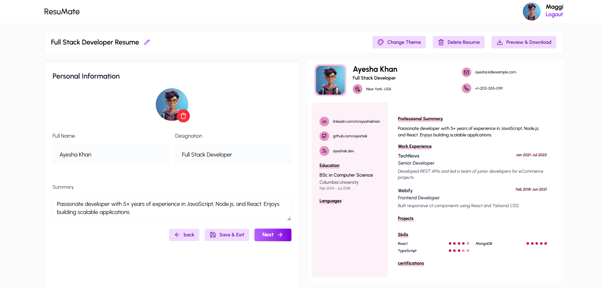

# 📄 ResuMate – Build Stunning Resumes Effortlessly

**ResuMate** is a modern, user-friendly resume builder that enables users to create professional, ATS-friendly resumes in minutes. It offers customizable templates, real-time previews, and seamless PDF exports. Designed with job seekers in mind, ResuMate simplifies the resume creation process with an intuitive interface and smart formatting.

> “Because first impressions matter — build your best resume with ResuMate.”

---

## 🚀 Live Demo

🌐 [Visit ResuMate Online](https://your-vercel-url.vercel.app)  

---

## 🛠️ Tech Stack

### 🌐 Frontend (React + Tailwind CSS)
- **React 19** – Component-based UI development
- **Tailwind CSS 4** – Utility-first responsive styling
- **React Router DOM 7** – Client-side routing
- **Framer Motion** – Smooth, elegant animations
- **Axios** – REST API communication
- **React Hot Toast** – Notification system
- **React Icons** – Icon library
- **Moment.js** – Time formatting
- **React-to-Print** – Resume printing
- **html2canvas** – Snapshot rendering

### 🧪 Backend (Node.js + Express)
- **Express 5** – Web server and routing
- **MongoDB + Mongoose** – NoSQL database and ORM
- **Cloudinary** – Resume and image upload & management
- **Multer** – Handling file uploads
- **JWT** – Secure authentication
- **bcryptjs** – Password hashing
- **dotenv** – Environment configuration
- **CORS** – Cross-origin requests

---

## ✨ Key Features

- 🎨 **Customizable Resume Templates** – Choose layouts and designs that fit your style.
- 👀 **Live Preview** – See changes instantly as you build.
- 📄 **PDF Export** – Download your resume as a high-quality PDF.
- 📸 **Cloud Image Uploads** – Add profile photos and logos.
- 🔐 **Secure Auth** – Register and log in securely using JWT.
- 📱 **Fully Responsive** – Works great on desktop, tablet, and mobile.
- ☁️ **MongoDB Cloud Storage** – Persistent resume data storage.

---
